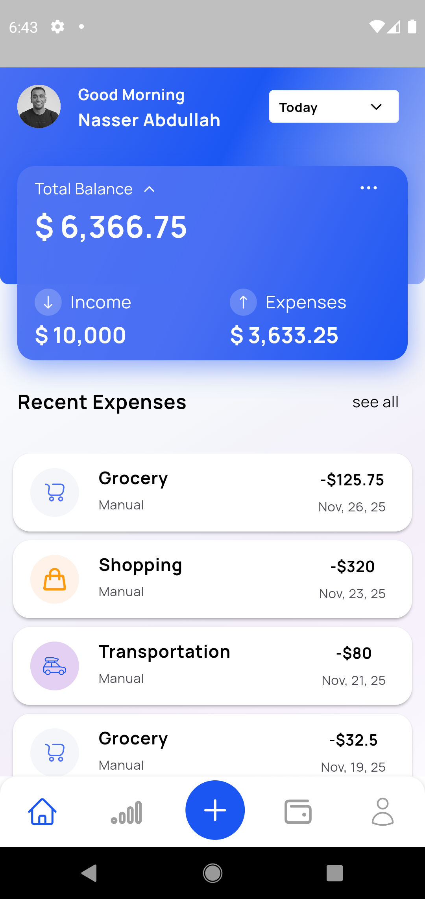
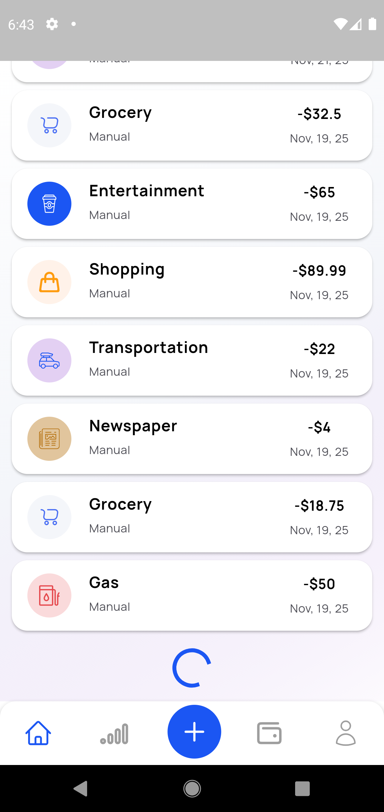
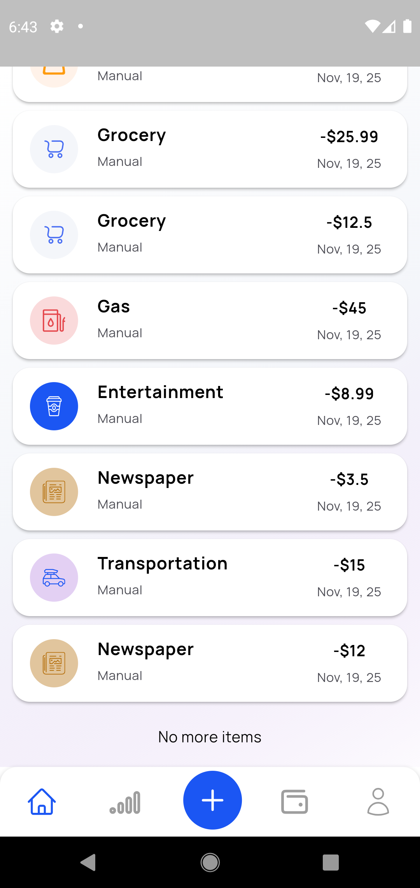
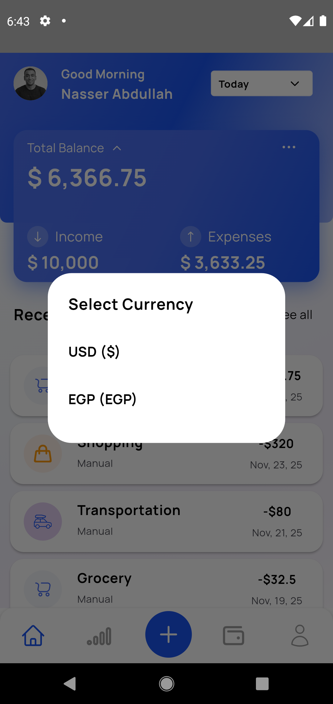
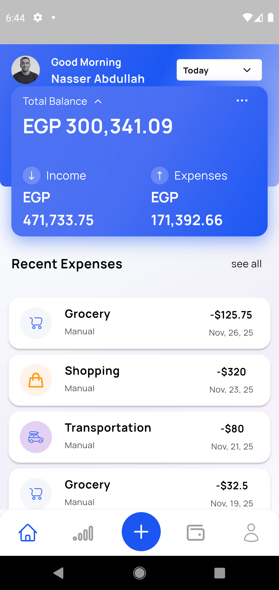
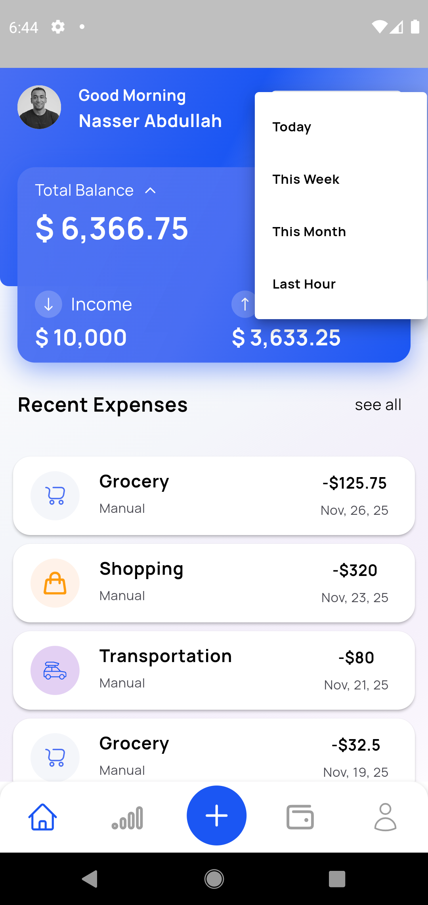
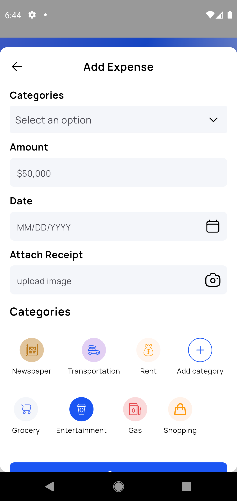
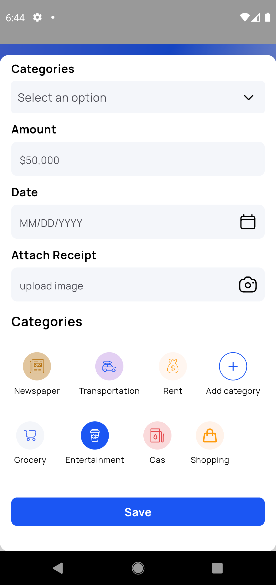

# Inovola Task - Expenses Tracker Application

A Flutter-based personal finance management application with multi-currency support, built using Clean Architecture principles and Bloc state management.

## 📋 Table of Contents
- [Screenshots](#screenshots)
- [Architecture Overview](#architecture-overview)
- [State Management](#state-management-approach)
- [API Integration](#api-integration)
- [Pagination Strategy](#pagination-strategy)
- [Trade-offs and Assumptions](#trade-offs-and-assumptions)
- [Getting Started](#how-to-run-the-project)
- [Known Issues](#known-bugs-or-unimplemented-features)

## Screenshots










## Architecture Overview

The application follows a **feature-first architecture** with clean separation of concerns, combining domain-driven design with practical Flutter patterns.

### Project Structure

```
lib/
├── core/
│   ├── components/                    # Global reusable UI components
│   │   ├── app_navigation_scaffold.dart
│   │   ├── app_button.dart
│   │   ├── app_overlay.dart
│   │   ├── app_single_selection_dropdown.dart
│   │   ├── app_text_input_field.dart
│   │   ├── default_error_widget.dart
│   │   ├── label_with_required_widget.dart
│   │   ├── shimmer_loading_list.dart
│   │   └── shimmer_loading_widget.dart
│   │
│   ├── handlers/                      # Global error & API handlers
│   │   ├── api_caller.dart           # HTTP request wrapper
│   │   ├── api_calls_handler.dart    # API call orchestration
│   │   ├── api_exceptions.dart       # Custom exception types
│   │   └── api_result.dart           # Result wrapper pattern
│   │
│   ├── models/                        # Core data models
│   │   ├── currency.dart             # Currency enum (USD/EGP)
│   │   ├── exchange_rate_response.dart
│   │   ├── exchange_rate_response.g.dart
│   │   ├── medium.dart               # Transaction medium enum
│   │   ├── purchased_item_category.dart
│   │   ├── purchased_item_database.dart
│   │   ├── purchased_item.dart
│   │   ├── purchased_item.g.dart
│   │   ├── sample_data_generator.dart
│   │   └── time_period.dart          # Time filter enums
│   │
│   ├── services/                      # Business services
│   │   └── exchange_rate_service.dart # Currency conversion
│   │
│   └── utils/                         # Utility functions
│       ├── color_helper.dart          # Color utilities
│       ├── date_time_helper.dart      # Date formatting
│       ├── file_helper.dart           # File operations
│       ├── image_helper.dart          # Image processing
│       ├── money_formatter.dart       # Currency formatting
│       ├── num_helper.dart            # Number utilities
│       ├── purchased_items_helper.dart
│       ├── string_helper.dart         # String utilities
│       ├── validator.dart             # Input validation
│       ├── api_environment.dart       # Environment config
│       ├── app_logger.dart            # Logging utility
│       └── app_routes.dart            # Route definitions
│
├── features/
│   └── home/
│       ├── bloc/                      # State management
│       │   ├── home_bloc.dart        # Main business logic
│       │   ├── home_event.dart       # User actions
│       │   └── home_state.dart       # UI states
│       │
│       ├── components/                # Feature-specific components
│       │   ├── add_expense_overlay/   # Add expense feature
│       │   │   ├── bloc/
│       │   │   │   ├── add_expense_bloc.dart
│       │   │   │   ├── add_expense_event.dart
│       │   │   │   └── add_expense_state.dart
│       │   │   ├── components/
│       │   │   │   ├── add_category_button.dart
│       │   │   │   └── expense_category_item_widget.dart
│       │   │   └── add_expense_overlay.dart
│       │   │
│       │   ├── balance_card.dart      # Dashboard balance display
│       │   ├── recent_expense_item_widget.dart
│       │   └── welcome_card.dart      # User greeting card
│       │
│       └── home_screen.dart           # Main screen
│
├── theme/                              # Application theming
│   ├── app_assets.dart                # Asset paths
│   ├── app_colors.dart                # Color palette
│   ├── app_fonts.dart                 # Typography
│   ├── app_styles.dart                # Text styles
│   └── app_theme.dart                 # Material theme
│
└── main.dart                          # Application entry point
```

### Architecture Layers

#### 1. **Core Layer**
- **Components**: Reusable UI widgets with consistent styling
- **Handlers**: Centralized API handling with error management
- **Models**: Data structures with JSON serialization
- **Services**: Business logic services (exchange rates, etc.)
- **Utils**: Helper functions for common operations

#### 2. **Features Layer**
- **Bloc**: State management for each feature
- **Components**: Feature-specific widgets
- **Screens**: Main UI pages

#### 3. **Theme Layer**
- Centralized styling and theming
- Asset management
- Consistent design system

## State Management Approach

### Bloc Pattern Implementation

The application uses **flutter_bloc** for predictable state management with clear separation between UI and business logic.

#### Main Blocs

1. **HomeBloc**
   ```dart
   Events:
   - LoadExpenses
   - FilterByTimePeriod
   - ChangeCurrency
   - RefreshData
   
   States:
   - HomeInitial
   - HomeLoading
   - HomeLoaded(expenses, balance, currency)
   - HomeError(message)
   ```

2. **AddExpenseBloc**
   ```dart
   Events:
   - SelectCategory
   - EnterAmount
   - SelectDate
   - AttachReceipt
   - SubmitExpense
   
   States:
   - AddExpenseInitial
   - AddExpenseInProgress
   - AddExpenseSuccess
   - AddExpenseFailure
   ```

### State Flow Architecture

```
User Input → Event → Bloc → Business Logic → State → UI Update
                              ↓
                         Repository
                              ↓
                    Local DB / Remote API
```

## API Integration

### Implementation Details

The application uses a robust API integration layer with comprehensive error handling:

#### Core Components

1. **ApiCaller**
   - Base HTTP client wrapper
   - Request/response logging
   - Timeout management
   - Header injection

2. **ApiCallsHandler**
   - Orchestrates multiple API calls
   - Implements retry logic
   - Handles token refresh
   - Manages request queuing

3. **ApiResult Pattern**
   ```dart
   class ApiResult<T> {
     final T? data;
     final ApiException? error;
     final bool isSuccess;
   }
   ```

4. **Exchange Rate Service**
   - Real-time currency conversion
   - Caching of exchange rates
   - Fallback to default rates

### Error Handling

Custom exceptions for different failure scenarios:
- `NetworkException`: Connection issues
- `ServerException`: 5xx errors
- `ClientException`: 4xx errors
- `ParseException`: JSON parsing failures
- `TimeoutException`: Request timeouts

## Pagination Strategy

### Local-First Pagination

The application implements a **hybrid pagination strategy** combining local storage with API synchronization:

#### Implementation Flow

1. **Initial Load**
   ```dart
   // Display from local storage
   return database.getExpenses(offset: 0, limit: 10);
   ```

2. **Infinite Scroll**
   - Detect when user scrolls near bottom (80% threshold)
   - Load next batch from local storage immediately
   - Trigger background API fetch for next page
   - Update local database with new items

3. **Data Synchronization**
   - Background sync every 5 minutes when app is active
   - Pull-to-refresh for manual sync
   - Conflict resolution: Server data takes precedence

#### Benefits
- ⚡ **Instant Response**: No network latency for pagination
- 📱 **Offline Mode**: Full functionality without internet
- 🔄 **Auto-sync**: Background updates without user intervention
- 💾 **Optimized Storage**: Only keeps last 1000 transactions locally

### UI Features
- **Material Design 3**: Modern, clean interface
- **Custom Components**: Reusable widgets with consistent styling
- **Loading States**: Shimmer effects for smooth transitions
- **Responsive Layout**: Adapts to different screen sizes
- **Navigation**: Bottom navigation with Home, Stats, Add, Wallet, Profile

## Trade-offs and Assumptions

### Technical Decisions

| Decision | Trade-off | Rationale |
|----------|-----------|-----------|
| **Local-first architecture** | Initial complexity vs. better UX | Instant loading and offline support outweigh setup complexity |
| **Bloc over Riverpod** | More boilerplate | Better separation of concerns and testability |
| **Custom API handler** | Reinventing the wheel | Full control over error handling and retry logic |
| **Shimmer loading** | Additional UI code | Better perceived performance than spinners |
| **Fixed categories** | Less flexibility | Simpler implementation and consistent UX |

### Assumptions

1. **API Specifications**
   - Paginated responses with 20 items per page
   - RESTful endpoints for CRUD operations
   - Exchange rates updated daily
   - Bearer token authentication

2. **User Requirements**
   - Primary use case: Personal expense tracking
   - Maximum 5 categories sufficient for MVP
   - Currency set globally, not per transaction
   - Receipts stored as image references

3. **Technical Constraints**
   - Local storage limit: 100MB
   - Network requests timeout: 30 seconds
   - Background sync interval: 5 minutes
   - Maximum file upload size: 5MB

## How to Run the Project

### Prerequisites

- Flutter SDK: `>=3.0.0 <4.0.0`
- Dart SDK: `>=3.0.0 <4.0.0`
- Android Studio or VS Code
- Git

### Installation Steps

1. **Clone Repository**
   ```bash
   git clone https://github.com/nasser2016170459/expenses_app.git
   cd expenses_app
   ```

2. **Install Dependencies**
   ```bash
   flutter pub get
   ```

3. **Environment Configuration**
   
   you will find `.env/prod.env` file:
   ```env
   BASE_URL=https://open.er-api.com
   ```

4. **Generate Code**
   ```bash
   flutter pub run build_runner build --delete-conflicting-outputs
   ```

5. **Run Configuration**

   **Android Studio:**
   - Run → Edit Configurations
   - Add to Additional run arguments:
     ```
     --dart-define-from-file=.env/prod.env
     ```
   - Create a new configuration and name it anything
   - Apply and OK

   **Command Line:**
   ```bash
   flutter run --dart-define-from-file=.env/prod.env
   ```

### Build for Production

```bash
# Android APK
flutter build apk --release --dart-define-from-file=.env/prod.env

# Android App Bundle
flutter build appbundle --release --dart-define-from-file=.env/prod.env

# iOS
flutter build ios --release --dart-define-from-file=.env/prod.env
```

## Known Bugs or Unimplemented Features

### Current Status
✅ **No known critical bugs**

### Completed Features
- ✅ Multi-currency support (USD/EGP)
- ✅ Expense categorization
- ✅ Time-based filtering
- ✅ Local pagination
- ✅ Shimmer loading states
- ✅ Add expense functionality
- ✅ Currency conversion

---

**Developer**: Nasser Abdullah  
**Repository**: [github.com/nasser2016170459/expenses_app](https://github.com/nasser2016170459/expenses_app)  
**Task**: Inovola Technical Assessment